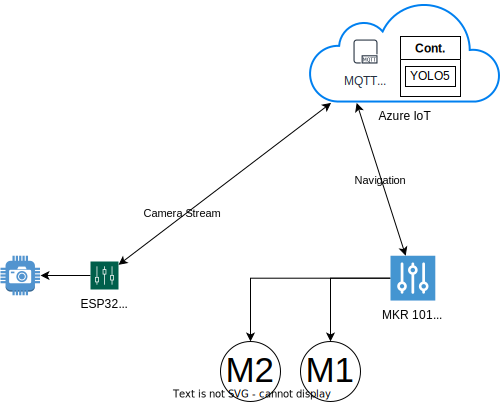
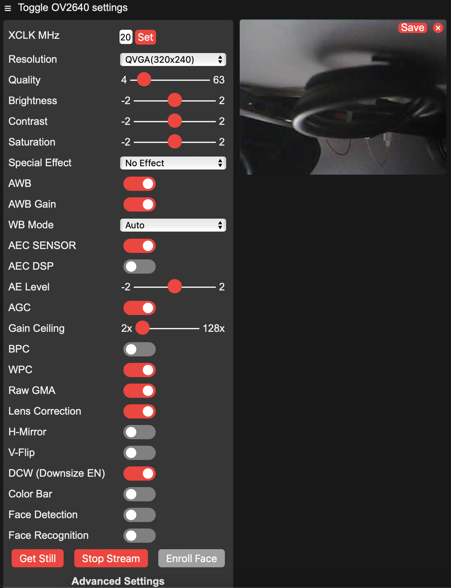

# 🤖🌭 Sloppy Joe - The cheap Turtlebot with Object Recognition

Since the *origianl* [Turtlebot](https://www.turtlebot.com/) isn't quite cheap, the idea was to build an even cheaper version based on Arduino/ESP32 using Azure IoT or any other MQTT cloud provider to do *difficult* calculations like object recognition, using the boards only to control the attached hardware.

## Hardware

* [Arduino MKR 1010 WiFi](https://store.arduino.cc/products/arduino-mkr-wifi-1010)
* L298N Motor Driver
* DC Motor + Wheels
* ESP32-CAM
* LiPo Batteries + Stepper

### Price List & Total Price

tbd

## Documentation

The Arduino and ESP are connected as a device to Azure IoT Hub via MQTT, as shown in the below drawing:



### ESP32-CAM Setup

1. Connect `IOO` and `GND` pin for flashing with jumper
2. Build image
3. Upload image
4. Disconnect jumper and reset board with button
5. Open monitor
6. Press reset button again and you should see:

```bash
WiFi connected
Camera Ready! Use 'http://192.168.178.43' to connect
```

7. Open address in browser and click start stream



### Connection Diagram

tbd --> https://fritzing.org/

## Useful Links

* Arduino MQTT Client Repo: https://github.com/arduino-libraries/ArduinoMqttClient
* Sending data over MQTT Example: https://docs.arduino.cc/tutorials/mkr-wifi-1010/mqtt-device-to-device
* Arduino DC Motor Guide: https://arduinogetstarted.com/tutorials/arduino-dc-motor
* CSR and Cloud Connectivity Tutorial: https://docs.arduino.cc/tutorials/mkr-wifi-1010/securely-connecting-an-arduino-mkr-wifi-1010-to-aws-iot-core
* Azure IoT Hub Connectivity: https://create.arduino.cc/projecthub/Arduino_Genuino/securely-connecting-an-arduino-nb-1500-to-azure-iot-hub-af6470 & related Issue: https://github.com/arduino-libraries/ArduinoMqttClient/issues/34
* Azure Sas Token Docs: https://docs.microsoft.com/en-us/azure/iot-hub/iot-hub-dev-guide-sas?tabs=node#use-sas-tokens-as-a-device and https://docs.microsoft.com/en-us/azure/iot-hub/iot-hub-mqtt-support
* Connect MKR 1010 to WiFi: https://docs.arduino.cc/tutorials/mkr-wifi-1010/connecting-to-wifi-network#
* **Cool IoT Tutorial: https://github.com/microsoft/IoT-For-Beginners/blob/main/1-getting-started/lessons/4-connect-internet/README.md**
* Another Project Example with Arduino/Azure IoT: https://paul-bruffett.medium.com/iot-azure-pipeline-9725ac2b6a00 and https://github.com/firedog1024/mkr1000-iotc
* Azure IoT SDK: https://github.com/Azure/azure-iot-sdk-c
* Free MQTT Broker: https://test.mosquitto.org/
* Firmata for Arduino: https://github.com/firmata/arduino
